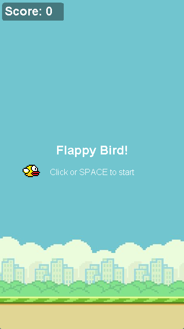

# FlappyBird

A Flappy Bird game written in Java using Swing and 2D Graphics. Guide the bird through pipes without crashing.

## preview

<div align="center">
  
</div>

## features

| feature                  | description                                     |
| ------------------------ | ----------------------------------------------- |
| start screen             | game waits for input before starting            |
| gravity and flap physics | bird falls naturally, jumps on input            |
| randomized pipes         | pipe gaps appear at different heights every run |
| collision detection      | ends the game on pipe or floor contact          |
| score tracking           | score increments for each pipe pair passed      |
| restart and exit         | buttons appear on screen after game over        |

## controls

| input            | action                  |
| ---------------- | ----------------------- |
| `space`          | flap the bird           |
| `left click`     | flap the bird           |
| `restart` button | restart after game over |
| `exit` button    | close the game          |

## requirements

- Java JDK 17 or newer
- `javac` and `java` available in your terminal
- VSCode with the Extension Pack for Java, or any Java-compatible IDE

## how to run

open a terminal in the project root folder (`FlappyBird/`), then:

**compile:**

```powershell
javac -d bin src\*.java
```

**run:**

```powershell
java -cp bin FlappyBirdRunner
```

## project structure

```
FlappyBird/
├── images/
│   ├── bottompipe.png
│   ├── flappybird.png
│   ├── flappybirdbg.png
│   └── toppipe.png
├── src/
│   ├── Bird.java               # bird entity
│   ├── FlappyBird.java         # game logic and rendering
│   ├── FlappyBirdRunner.java   # entry point
│   ├── GameFrame.java          # game window
│   └── Pipe.java               # pipe entity
└── README.md
```

## key classes

**FlappyBird.java**

- game loop via a Timer firing 60 times per second
- handles bird movement, pipe spawning, collision detection, and all rendering
- implements ActionListener, KeyListener, and MouseListener

**GameFrame.java**

- sets up the JFrame window and adds the game panel

**Bird.java / Pipe.java**

- entity classes storing position, size, and image for each object
